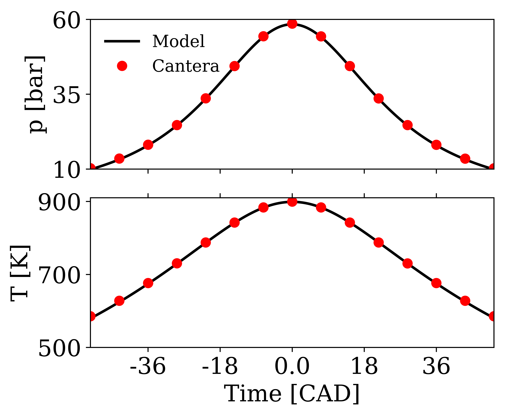

# compressionHeatingModel


## Why do I need this?

In many combustion applications such as Reactivity Controlled Compression Ignition (RCCI), the direct injection of the high-reactivity fuel occurs early during the compression stroke. Therefore, the effect of compression heating must be taken into account for proper modeling of ignition/combustion characteristics. While in engine simulations volumetric compression via mesh motion is often used, for more fundamental analysis (such as 2D/3D DNS), mesh motion is not a viable option. 

## Implementation
This model adds a compression heating source term to the governing N-S equations to account for the thermophysical changes during compression. We implemented this source term approach  OpenFOAM via fvOptions [[1]](#1), following the implementations by [[2]](#2) and [[3]](#3), 

&space;=&space;P_{0,m}[1&plus;g^2\pi^2\frac{{t-t_0}^2}{{t_c}^2}]^{-n},)


where P<sub>0,m</sub> is the desired motored pressure value at the TDC, t<sub>c</sub> is the time it takes for one crank rotation, t<sub>0</sub> is the time at the TDC point and g and n are model constants for matching the engine geometry. Note that this model introduces mass to your system through a mass source term to increase/decrease the pressure instead of changing the system volume. Therefore, while your species mass fractions are conserved, your mass is not. This may be an issue especially if you are interested with doing an emission analysis in ppm units.

<p align="center">
    
    <br>
    <em>Figure: Validation of the pressure and temperature profiles under compression with the Cantera 0D ic_engine solution.</em>
</p>

## Usage 

In simple terms, source OpenFOAM-8, then run:

```
./Allrun
```

Further info:

Under ```
constant/source_specie/```
 folder you can find a python script that uses the chemistry input files to generate the source term files for the specie. It generates new input files for a given chemical mechanism input. These files are then read by the ```
fvOptions```
 file, which includes the full implementation of the compression heating source term. The current fvOptions is configured for a certain engine condition (1200 RPM with T=900K and p=60 bar at TDC). The configuration should be changed by changing the model constants of the compression heating source term to match the desired conditions.

## Getting help and reporting bugs

Please submit a GitHub issue if you found a bug in the program. If you need help with the software or have further questions, contact bulut.tekgul@aalto.fi.

## Citation
If you use our model, please cite the publication describing its implementation [[1]](#1).

## References

<a id="1">[1]</a> 
B. Tekgül, H. Kahila, S. Karimkashi, O. Kaario, Z. Ahmad, E. Lendormy, J. Hyvönen, V. Vuorinen. [Large-eddy simulation of spray assisted dual-fuel ignition under reactivity-controlled dynamic conditions](https://doi.org/10.1016/j.fuel.2021.120295), Fuel, 293 (2021).

<a id="2">[2]</a> 
A. Bhagatwala, J.H. Chen, T. Lu. [Direct numerical simulations of HCCI/SACI with ethanol](https://doi.org/10.1016/j.combustflame.2013.12.027), Combust. Flame, 161 (7) (2014), pp. 1826-1841.

<a id="3">[3]</a> 
M.B. Luong, R. Sankaran, G.H. Yu, S.H. Chung, C.S. Yoo
[On the effect of injection timing on the ignition of lean PRF/air/EGR mixtures under direct dual fuel stratification conditions](https://doi.org/10.1016/j.combustflame.2017.05.023),
Combust. Flame, 183 (2017), pp. 309-321, 